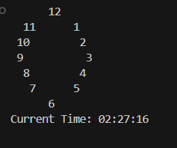

# 🕰️ Terminal-Based Analog Clock in C

This is a simple **console-based analog clock simulation** created in C. It mimics the analog clock face layout using ASCII art and displays the **live current time** updated every second.

## 🛠️ Key Features

- ⏱️ Real-time display of current time (HH:MM:SS)
- 🧭 ASCII-based analog clock face
- 🔁 Continuously refreshes every second
- 🧹 Clears console before each refresh for clean display

## 🧠 Concepts Used

- `time.h` for accessing system time
- `unistd.h` for delay (`sleep(1)`)
- Console clearing with ANSI escape codes (`\033[H\033[J`)

## 📸 Screenshot

> 

📦 analog-clock/
┣ 📄 analog_clock.c ← Source code
┗ 📄 README.md ← Project description

## ⚖️ License

This project is licensed under the [MIT License](LICENSE) — free to use and modify.

---

✨ Made with C and ❤️ for learning and practicing system time-based simulations.
