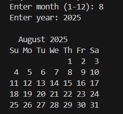

📅Calendar Generator in C  
This is a simple console-based **calendar generator** created in C. It allows users to enter a month and year, then displays a formatted calendar with correct day alignment using ASCII layout.

🛠️ Key Features  
📆 Displays full calendar for any given month and year  
🧮 Accurate day placement using Zeller’s Congruence  
📅 Leap year detection included  
🖥️ Neat console output with week structure

🧠 Concepts Used  
📌 `time.h` for basic time utilities  
📌 Zeller’s Algorithm for weekday calculation  
📌 Conditional logic to handle leap years and months with different days  
📌 Functions and modular code structure in C

📸 Screenshot  

📦 calendar-generator/
┣ 📄 calendar.c ← Source code
┗ 📄 README.md ← Project description

⚖️ License
This project is licensed under the MIT License — feel free to use, modify, and share.

✨ Made with C and ❤️ for mastering date & time logic in programming.
