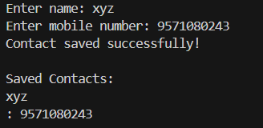

📇 Terminal-Based Contact Saver in C  
This project is a simple terminal-based **contact saver** developed in C. It allows users to input a contact name and mobile number, saves them to a text file, and then displays all saved contacts.

🛠️ Key Features  
📝 Save new contacts (name + mobile number)  
📂 Store data in a local text file (`contacts.txt`)  
🔍 Display all previously saved contacts  
📦 Appends data instead of overwriting

🧠 Concepts Used  
📌 File handling in C using `fopen()`, `fprintf()`, `fgets()`, `fclose()`  
📌 Use of append (`a`) and read (`r`) modes  
📌 Buffering input and output using standard functions  
📌 Basic string and array handling

📸 Screenshot  

📦 contact-saver/
┣ 📄 contact_saver.c ← Source code
┣ 📄 contacts.txt ← Saved contacts file (auto-generated)
┗ 📄 README.md ← Project description

⚖️ License
This project is licensed under the MIT License — feel free to use, modify, and share.

✨ Made with C and ❤️ for learning file I/O and building basic data storage tools.
