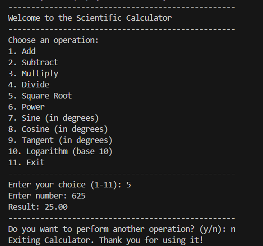

🧮 Scientific Calculator in C  
This project is a **terminal-based scientific calculator** written in C that supports both basic and advanced mathematical operations. It’s a menu-driven program that allows repeated usage until the user exits.

🎯 Features  
➕ Addition, ➖ Subtraction, ✖️ Multiplication, ➗ Division  
📐 Square root, Power, Sine, Cosine, Tangent  
📊 Logarithm (base 10)  
🔁 Looping functionality to perform multiple operations in a session  
🛑 Input validation for edge cases (e.g., division by zero, log of negative numbers)

🧠 Concepts Used  
🧾 Conditional statements and `switch` control structure  
🔁 Infinite loop with `while(1)` and manual break conditions  
📥 Input using `scanf()` and buffer handling using `getchar()`  
📦 Modular functions for each operation  
📐 Trigonometric operations with angle conversion from degrees to radians  
🧮 Use of `math.h` library for mathematical functions like `sqrt()`, `pow()`, `sin()`, `log10()` etc.

📸 Screenshot  

scientific-calculator/
┣ 📄 calculator.c       ← Main source file
┗ 📄 README.md           ← This file

⚖️ License
This project is open-source and available under the MIT License.

✨ Built in C for learning advanced I/O and mathematical logic in CLI tools.
