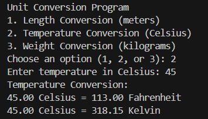

# 🔄 Terminal-Based Unit Converter in C

This is a simple terminal-based unit converter written in C. It allows users to convert values between different units for **length**, **temperature**, and **weight** — all via console interaction.

---

## 🛠️ Key Features
- 📏 Convert meters to kilometers, centimeters, and millimeters  
- 🌡️ Convert Celsius to Fahrenheit and Kelvin  
- ⚖️ Convert kilograms to grams and pounds  
- 🔘 Simple menu-driven interface with user input  

---

## 🧠 Concepts Used
- 📌 Use of `switch` statement for menu options  
- 📌 Floating-point arithmetic for accurate conversions  
- 📌 Modular functions for each conversion type  
- 📌 Console I/O using `printf()` and `scanf()`  

---

## 📸 Screenshot

---

## 📁 Project Structure
unit-converter/
┣ 📄 unit_converter.c ← Source code
┗ 📄 README.md ← Project description

---

## ⚖️ License

This project is licensed under the **MIT License** — free to use, modify, and distribute.

---

✨ Made with C and ❤️ to practice modular programming and unit-based arithmetic.
